# OpenCN 进给率优化系统——完整代码流程文档

本文档梳理 `common/Feedopt/` 目录下全部代码的调用链路与数据流向。  
所有流程图使用 Mermaid 语法（VSCode / GitHub / Obsidian 可直接渲染）。

---

## 目录

1. [系统总览](#1-系统总览)
2. [核心数据结构详解](#2-核心数据结构详解)
3. [初始化：initFeedoptPlan](#3-初始化initfeedoptplan)
4. [FSM 状态机与外层驱动](#4-fsm-状态机与外层驱动)
5. [阶段 1：G-Code 解析（GCode）](#5-阶段-1g-code-解析gcode)
6. [阶段 2：几何检查（Check）](#6-阶段-2几何检查check)
7. [阶段 3：曲线压缩（Compress）](#7-阶段-3曲线压缩compress)
8. [阶段 4：平滑过渡（Smooth）](#8-阶段-4平滑过渡smooth)
9. [阶段 5：曲线分割（Split）](#9-阶段-5曲线分割split)
10. [阶段 6：进给率优化（Opt）](#10-阶段-6进给率优化opt)
11. [LP 约束矩阵构建详解](#11-lp-约束矩阵构建详解)
12. [曲线截取子系统（cutCurvStruct）](#12-曲线截取子系统cutcurvstruct)
13. [曲线求值子系统（EvalCurvStruct）](#13-曲线求值子系统evalcurvstruct)
14. [弧长计算子系统](#14-弧长计算子系统)
15. [关键参数速查表](#15-关键参数速查表)
16. [完整函数调用树](#16-完整函数调用树)

---

## 1. 系统总览

### 1.1 七阶段数据流

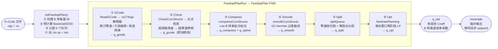

### 1.2 各阶段输入输出汇总

| 阶段 | 入口函数 | 读取队列 | 写入队列 | 关键变换 |
|------|---------|---------|---------|---------|
| Init | `initFeedoptPlan` | — | 创建所有队列 | 预计算 B 样条基矩阵 |
| GCode | `ReadGCode` | G-Code 文件 | `q_gcode` | rs274ngc 解析、换刀零速、deg→rad |
| Check | `CheckCurvStructs` | `q_gcode` | `q_gcode`（原地） | 尖点→零速停顿 |
| Compress | `compressCurvStructs` | `q_gcode` | `q_compress`, `q_spline` | 直线批次 Lee B 样条拟合 |
| Smooth | `smoothCurvStructs` | `q_compress` | `q_smooth` | G2 Hermite 过渡曲线插入 |
| Split | `splitQueue` | `q_smooth` | `q_split` | 零速段切割 + 等弧长分段 |
| Opt | `feedratePlanning` | `q_split` | `q_opt` | 滑动窗口两阶段 LP |

---

## 2. 核心数据结构详解

### 2.1 CurvStruct 完整字段

```
CurvStruct                          说明
├── Info
│   ├── Type        CurveType       曲线几何类型（见下表）
│   ├── zspdmode    ZSpdMode        零速模式（NN/ZN/NZ/ZZ）
│   ├── FeedRate    double          G-Code 编程进给率（mm/min）
│   ├── SpindleSpeed double         主轴转速（rpm）
│   ├── gcode_source_line int32     对应 G-Code 的行号（调试用）
│   └── TRAFO       bool            是否需要运动学坐标变换（5 轴联动）
│
├── a_param         double ∈(0,1]   参数窗口宽度（全局参数区间长度）
├── b_param         double ∈[0,1)   参数窗口起点（全局参数区间起始）
│       → 曲线在全局参数空间 [b, b+a] 上定义
│       → 求值时：u_global = a*u_local + b，u_local ∈ [0,1]
│
├── R0              [NAxis×1]       全轴起点坐标（含旋转轴，弧度）
├── R1              [NAxis×1]       全轴终点坐标
│
├── ── Line 专用 ──────────────────────────────────────────────
│   （无额外字段，R0/R1 即为起终点）
│
├── ── Helix 专用 ─────────────────────────────────────────────
│   ├── evec            [3×1]       螺旋轴方向单位向量 ê
│   ├── theta           double      总圆心角 θ（rad，正/负对应方向）
│   ├── pitch           double      螺距（mm/圈，纯圆弧时=0）
│   └── CorrectedHelixCenter [3×1] 修正后的圆心 C
│
├── ── Spline 专用 ─────────────────────────────────────────────
│   └── sp_index        int32       q_spline 中 B 样条数据的索引
│
├── ── TransP5 专用 ────────────────────────────────────────────
│   └── CoeffP5         [NDim×6]    五次多项式系数矩阵（每行一轴，降幂排列）
│
├── ── 零速段专用 ──────────────────────────────────────────────
│   ├── UseConstJerk    bool        是否使用恒定跃度速度曲线（cutZeroStart/End 设置）
│   └── ConstJerk       double      恒定跃度参数 jps（zeroSpeedCurv 预计算）
│
├── tool                            刀具信息（类型、偏移量）
└── Coeff           [N×1]           优化后的 B 样条进给率系数（Opt 阶段填入）
```

### 2.2 CurveType 枚举

| 值 | 名称 | 参数化公式 | 弧长均匀性 |
|----|------|-----------|-----------|
| 0 | None | — | — |
| 1 | Line | `r(u) = P0(1-u) + P1·u` | 均匀（‖r'‖=‖P1-P0‖=常数） |
| 2 | Helix | `r(u) = C + cos(θu)·CP0 + sin(θu)·(ê×CP0) + (p/2π)·θu·ê` | 均匀（‖r'‖=√(θ²R²+(θp/2π)²)=常数） |
| 3 | Spline | B 样条，4 次，C2 连续 | 非均匀（需数值积分） |
| 4 | TransP5 | `r(u) = Σ c_j·u^j`，j=0..5 | 非均匀（需中点积分） |

### 2.3 ZSpdMode 枚举与转换关系

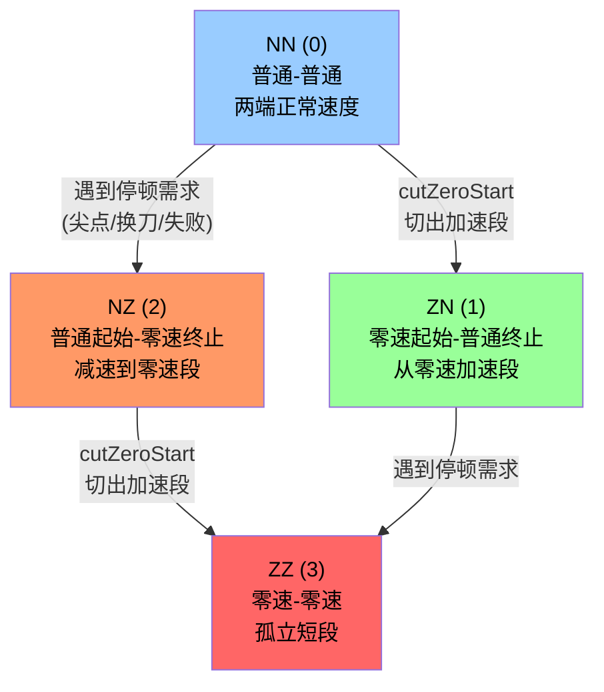

### 2.4 六个流水线队列

```mermaid
flowchart LR
    qG[(q_gcode\nCurvStruct[]\nGCode 阶段填充)]
    qC[(q_compress\nCurvStruct[]\nCompress 填充)]
    qSp[(q_spline\nBSpline[]\nCompress 填充)]
    qSm[(q_smooth\nCurvStruct[]\nSmooth 填充)]
    qSplit[(q_split\nCurvStruct[]\nSplit 填充)]
    qOpt[(q_opt\nCurvStruct[含Coeff]\nOpt 填充)]

    qG --> qC
    qG -.-> qSp
    qC --> qSm
    qSm --> qSplit
    qSplit --> qOpt

    note1["Compress 阶段:\n消费 q_gcode\n产出 q_compress\n同步产出 q_spline"]
    note2["Smooth 阶段:\n读 q_compress + q_spline\n产出 q_smooth"]
    note3["Opt 阶段:\n读 q_split + q_spline\n产出 q_opt"]
```

### 2.5 ctx 上下文关键字段

```
ctx
├── cfg             FeedoptDefaultConfig   配置结构体（所有可调参数）
├── op              Fopt                   当前 FSM 状态
├── k0              int32                  当前处理曲线的索引指针
├── go_next         bool                   上次是否产出结果（驱动 k0++）
├── zero_start      bool                   当前窗口起端为零速
├── zero_end        bool                   当前窗口末端为零速
├── zero_forced     bool                   是否强制插入了零速停顿
├── zero_forced_buffer [2]CurvStruct       强制零速时的缓冲曲线
├── v_0/v_1         double                 窗口起/末端速度边界条件
├── at_0/at_1       double                 窗口起/末端切向加速度边界
├── BasisVal        [M×N]                  B 样条基函数值（预计算）
├── BasisValD       [M×N]                  B 样条基一阶导（预计算）
├── BasisValDD      [M×N]                  B 样条基二阶导（预计算）
├── BasisIntegr     [N×1]                  B 样条基积分（目标函数用）
├── u_vec           [1×M]                  离散化参数点
├── Bl              BSpline                B 样条基结构体
├── Coeff           [N×NWindow]            上一次 LP 的解（分配给零速路径）
├── kin             Kinematics             运动学对象（5 轴坐标变换）
├── q_gcode / q_compress / q_spline / q_smooth / q_split / q_opt
└── errcode / errmsg                       错误信息（异常时设置）
```

---

## 3. 初始化：initFeedoptPlan

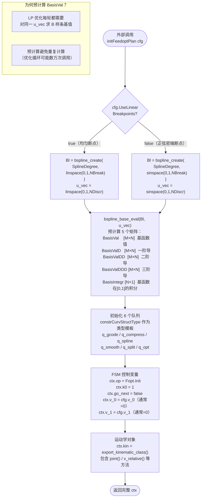

---

## 4. FSM 状态机与外层驱动

### 4.1 FeedoptPlanRun 外层循环

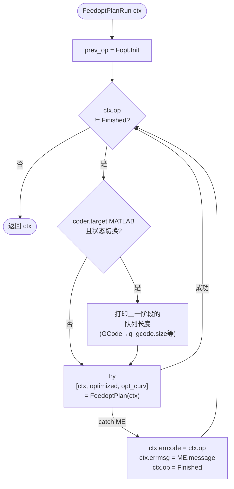

### 4.2 FeedoptPlan FSM 状态转换

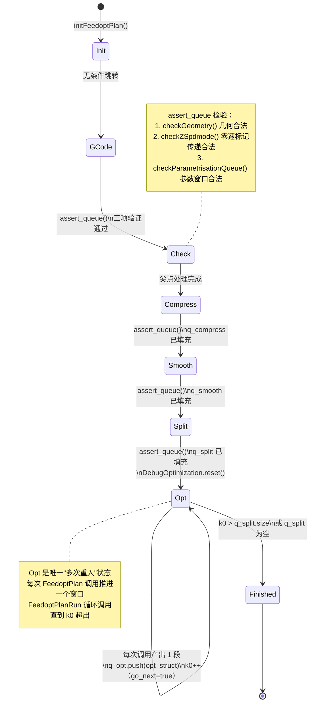

---

## 5. 阶段 1：G-Code 解析（GCode）

**入口**：`FeedoptPlan` case `Fopt.GCode`  
**核心**：`ReadGCode()` 封装 rs274ngc 解释器（MATLAB: MEX；codegen: 内嵌 C++）

### 5.1 主流程

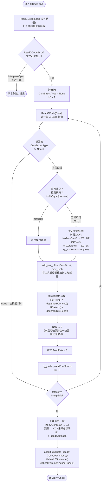

### 5.2 assert_queue 三项验证

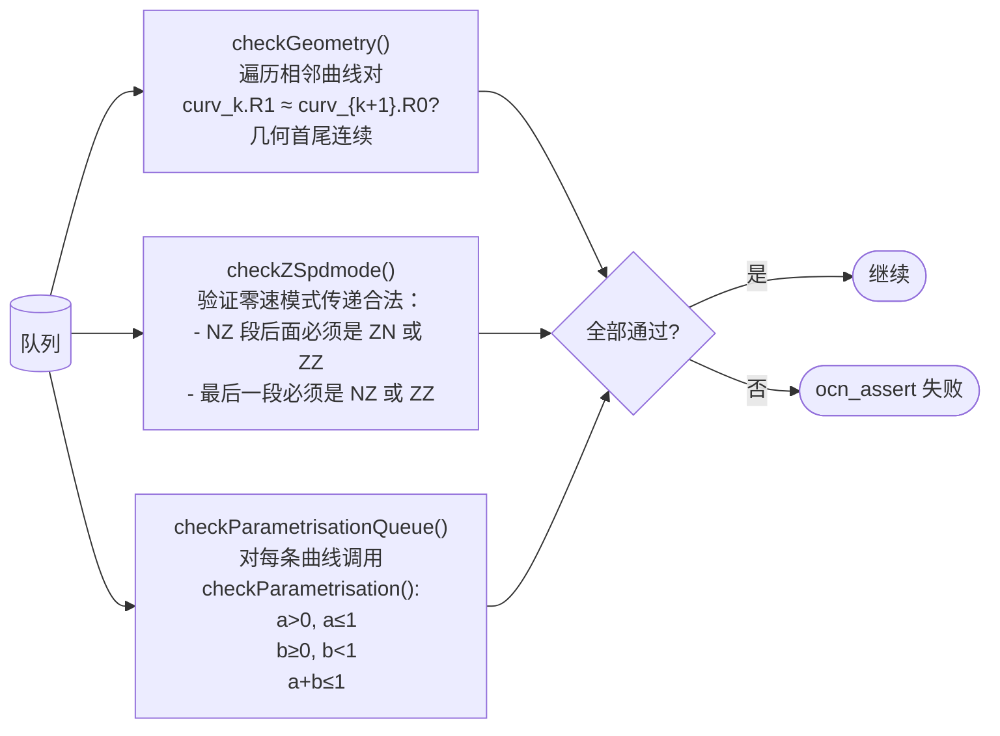

---

## 6. 阶段 2：几何检查（Check）

**入口**：`FeedoptPlan` case `Fopt.Check`  
**核心**：`CheckCurvStructs()` + `iscusp()`

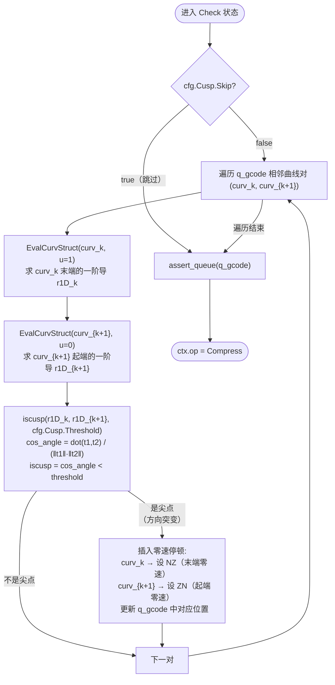

---

## 7. 阶段 3：曲线压缩（Compress）

**入口**：`FeedoptPlan` case `Fopt.Compress`  
**核心**：`compressCurvStructs()` → 批次机制 + Lee 算法

### 7.1 主流程

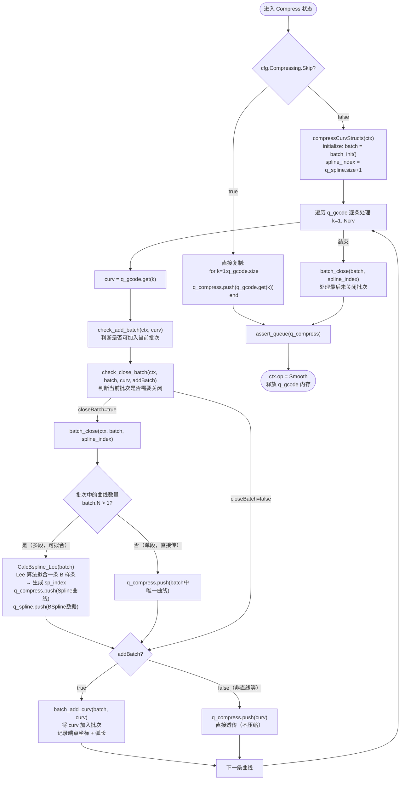

### 7.2 批次准入条件（check_add_batch）

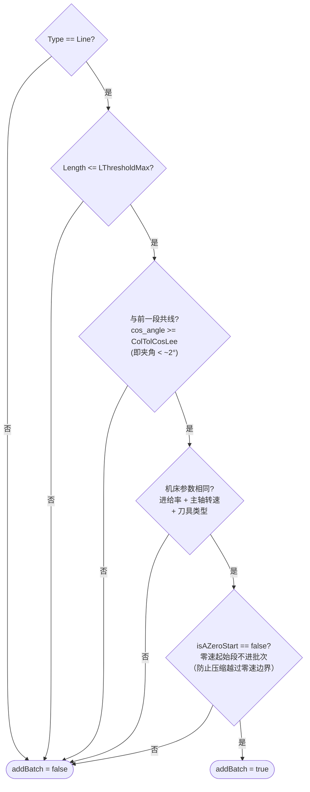

### 7.3 批次关闭条件（check_close_batch）

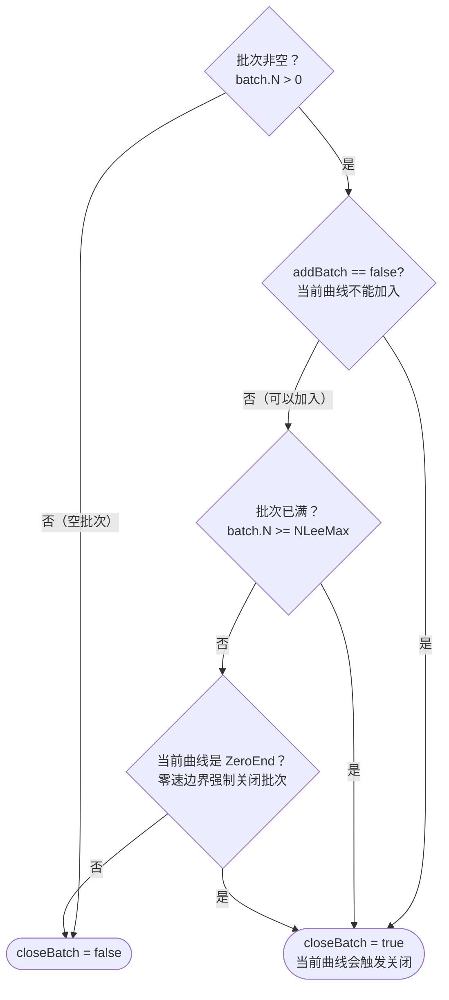

### 7.4 Lee 算法 B 样条拟合（CalcBspline_Lee）

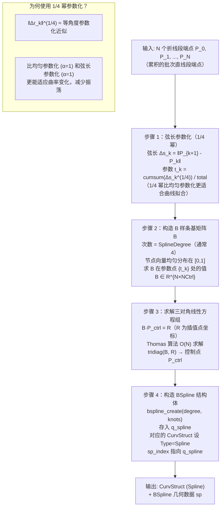

---

## 8. 阶段 4：平滑过渡（Smooth）

**入口**：`FeedoptPlan` case `Fopt.Smooth`  
**核心**：`smoothCurvStructs()` + `calcTransition()` + `G2_Hermite_Interpolation_nAxis()`

### 8.1 主循环逻辑

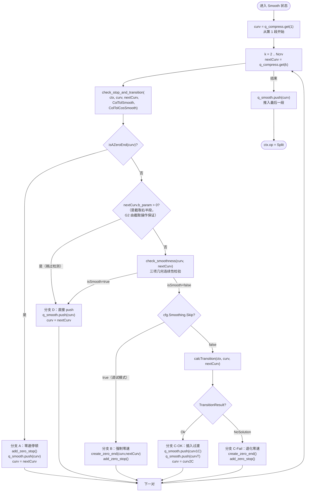

### 8.2 G2 连续性三项检验（check_smoothness）

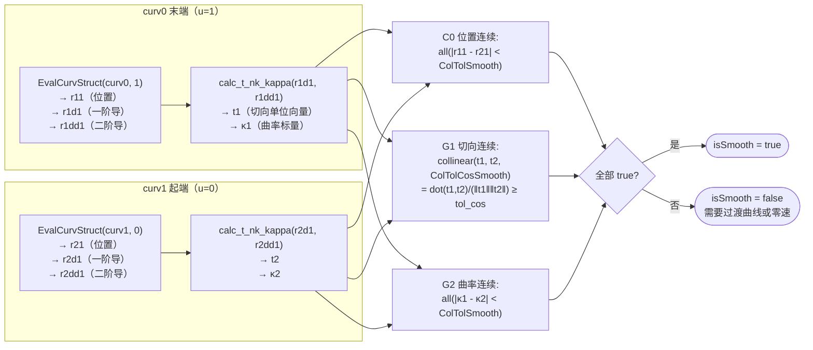

### 8.3 calcTransition 过渡曲线计算

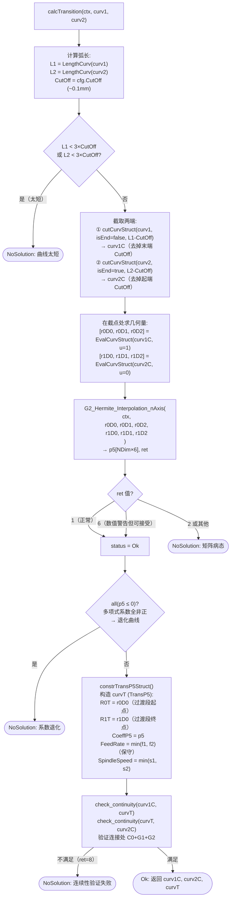

### 8.4 G2 Hermite 插值（G2_Hermite_Interpolation_nAxis）

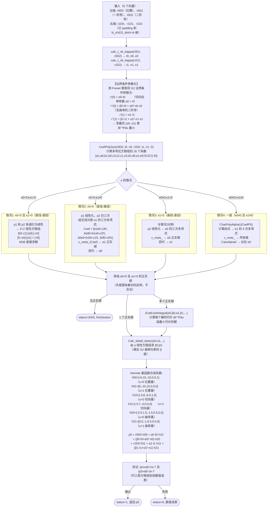

---

## 9. 阶段 5：曲线分割（Split）

**入口**：`FeedoptPlan` case `Fopt.Split`  
**核心**：`splitQueue()` → `splitCurvStruct()` 逐条处理

### 9.1 splitCurvStruct 主流程

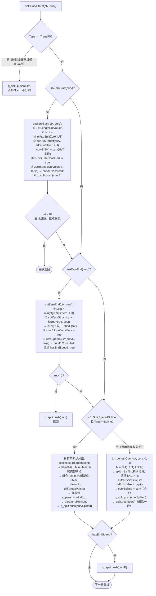

### 9.2 恒定跃度速度曲线（constJerkU）

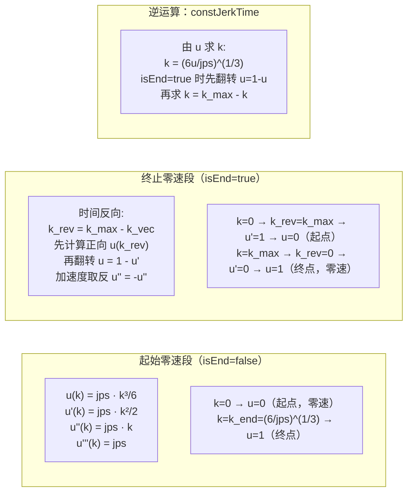

---

## 10. 阶段 6：进给率优化（Opt）

**入口**：`FeedoptPlan` case `Fopt.Opt`（多次重入）  
**核心**：`feedratePlanning()` → 滑动窗口 + `FeedratePlanning_LP()`

### 10.1 滑动窗口主逻辑

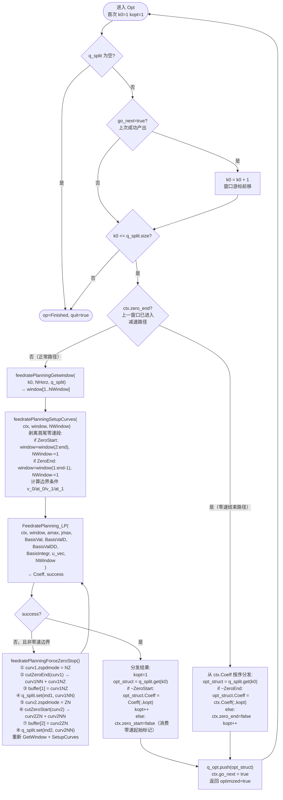

### 10.2 窗口边界条件建立（feedratePlanningSetupCurves）

```mermaid
flowchart TD
    subgraph IN["输入窗口（最多 NHorz 段）"]
        direction LR
        CS["first\nZN（零速起始）"] --> M1["middle1\nNN"] --> M2["middle2\nNN"] --> M3["...\nNN"] --> CE["last\nNZ（零速终止）"]
    end

    IN --> PROC

    subgraph PROC["处理逻辑"]
        P1{"first 是 ZeroStart?"}
        P1 -- "是" --> P1Y["ctx.zero_start = true\nwindow = window(2:end)\nNWindow -= 1"]
        P1 -- "否" --> P1N["ctx.zero_start = false"]

        P2{"last 是 ZeroEnd?"}
        P2 -- "是" --> P2Y["ctx.zero_end = true\nwindow = window(1:end-1)\nNWindow -= 1"]
        P2 -- "否" --> P2N["ctx.zero_end = false"]
    end

    PROC --> BC

    subgraph BC["边界条件计算"]
        BC1{"zero_start=true?"}
        BC1 -- "是" --> BC1Y["calcZeroConstraints(ctx, first, false)\n在 curvS 末端（连接处）求:\n  k = (6/jps)^(1/3) → u=1\n  [u,ud,udd,uddd] = constJerkU(jps,k,false)\n  [r0D,r1D,r2D,r3D] = EvalCurvStruct(curvS,u)\n  [v_0, at_0] = calcNormVNormAT(V,A,r1D)\nctx.v_0 = v_0\nctx.at_0 = at_0"]

        BC2{"zero_end=true?"}
        BC2 -- "是" --> BC2Y["calcZeroConstraints(ctx, last, true)\n在 curvE 起端（连接处）求:\n  k = 0 → 对应反向时间起点\n  [u,ud,udd,uddd] = constJerkU(jps,0,true)\n  [v_1, at_1] = calcNormVNormAT(...)\nctx.v_1 = -v_1（取负，适配约束形式）\nctx.at_1 = -at_1"]
        BC2 -- "否" --> BC2N["ctx.v_1 = -cfg.v_1（配置预设值）\nctx.at_1 = -cfg.at_1"]
    end
```

---

## 11. LP 约束矩阵构建详解

**入口**：`FeedratePlanning_LP()` → `buildConstr()` + `buildConstrJerk()`

### 11.1 LP 问题完整形式

```
决策变量：
  x = [w_1; w_2; ...; w_NWindow]   ∈ R^(N×NWindow)
  w_k(u) = BasisVal(u) · x_k ≈ v²(u)（第 k 段速度的平方）

  （实际求解时 x 会加上 slack 变量，防止不可行）

目标函数（最小化，等价于最大化 ∫v²du）：
  min  f^T · x = -BasisIntegr^T · x_k（各段求和）
  → 最大化速度积分 ≈ 最小化行程时间

第一阶段约束（速度 + 加速度）：
  不等式 A·x ≤ b：
    ①  BasisVal·x_k ≤ f_max(u)       速度上限 v² ≤ min(v_axis²/‖r'‖², F²/‖r'‖²)
    ② -BasisVal·x_k ≤ 0              速度非负 v² ≥ 0
    ③  Acc·x_k ≤ amax                各轴加速度上限（M×Ndim 个约束）
    ④ -Acc·x_k ≤ amax                各轴加速度下限
  等式 Aeq·x = beq：
    ⑤ v²(u=0 of w_1) = v_0²          起端速度条件
    ⑥ at(u=0 of w_1) = at_0          起端切向加速度条件
    ⑦ v²(u=1 of w_k) = v²(u=0 of w_{k+1})  段间速度连续
    ⑧ at(u=1 of w_k) = at(u=0 of w_{k+1})  段间加速度连续
    ⑨ v²(u=1 of w_NW) = v_1²         末端速度条件
    ⑩ at(u=1 of w_NW) = at_1         末端切向加速度条件

第二阶段约束（在第一阶段基础上添加跃度）：
  [r'''·BasisVal + 1.5·r''·BasisValD + 0.5·r'·BasisValDD]·x_k·v ≤ jmax
  （其中 v=sqrt(BasisVal·Coeff_phase1) 是线性化点，使约束关于 x 线性）
```

### 11.2 buildConstr 约束矩阵构建

```mermaid
flowchart TD
    A["buildConstr(ctx, windowCurv, amax,\n v_0, at_0, v_1, at_1, BasisVal, BasisValD, u_vec)"]

    A --> DIM["维度计算:\nNdim = NumberAxis（激活轴数）\nNwindow = len(windowCurv)\nM,N = size(BasisVal)\nNx = N×Nwindow\nNc = 2 + 2×Ndim（每点不等式数）\nNec = 2×(Nwindow+1)（等式约束数）"]

    DIM --> ALLOC["预分配矩阵:\nA   [Nc×M×Nwindow,  Nx]  不等式约束\nb   [Nc×M×Nwindow,  1 ]\nAeq [Nec, Nx]             等式约束\nbeq [Nec, 1]"]

    ALLOC --> LOOP["for k=1..Nwindow"]

    LOOP --> EVAL["EvalCurvStruct(windowCurv(k), u_vec)\n→ r0D, r1D, r2D, r3D"]

    EVAL --> KIN{"TRAFO=true?"}
    KIN -- "是（5轴）" --> KIN5["ctx.kin.joint(r0D, r1D, r2D, r3D)\n笛卡尔→关节空间\n→ r1D_a（关节一阶导）\n→ r2D_a（关节二阶导）"]
    KIN -- "否" --> KIN3["ctx.kin.v_relative(r0D, r1D)\n→ r1D_r（相对速度，用于进给率约束）\nr1D_a = r1D（直接用于加速度约束）"]

    KIN5 & KIN3 --> VMAX["速度上限 f_max（取所有约束中最小值）:\n  轴速度约束: v_k_max² = (vmax_j/r1D_a_j)²\n  进给率约束: F²/‖r1D_r(CartAxes)‖²\n  f_max = min(所有约束) 逐点取最小"]

    VMAX --> ACC["加速度约束矩阵 Acc [M×Ndim, N]:\n对每轴 j:\n  Acc_j = r2D_a_j · BasisVal\n        + 0.5 · r1D_a_j · BasisValD"]

    ACC --> ASSMB["装配不等式约束块（第 k 段）:\n行 indAL = (k-1)×Nc×M + 1 : k×Nc×M\n列 indAC = (k-1)×N + 1 : k×N\nA(indAL, indAC) =\n  [  BasisVal  ]  → 速度上限\n  [ -BasisVal  ]  → 速度非负\n  [  Acc       ]  → 加速度上限\n  [ -Acc       ]  → 加速度下限\nb(indAL) = [f_max; 0; amax; amax]"]

    ASSMB --> CONT["连续性方程（等式约束）:\n起/末端切线向量 t = r1D(:,[1,end])/‖r1D‖\n起/末端 v²行 = ‖r1D([1,end])‖² × BasisVal([1,end],:)\n起/末端 at行 = t' × Acc([indAT_1,:]) / (...)\n\nAeq(indAEL, indAEC) += continuity × mask\nmask_continuity = [+1;+1;-1;-1]\n（前段末端+，后段起端-，差=0实现连续性）"]

    CONT --> NEXT["下一段"] --> LOOP

    LOOP -- 结束 --> BEQ["设置边界条件等式右端:\nbeq([1,2,end-1,end]) =\n  [v_0²; at_0; v_1²; at_1] × mask_continuity"]

    BEQ --> RAMP["约束斜坡（Ramp）:\n末尾段适当降低速度/加速度上限\n避免优化器在窗口末尾"超前"规划\nvel_ramp = linspace(1, VEL_RAMP_OVER_WINDOWS, M)\nacc_ramp = linspace(1, ACC_RAMP_OVER_WINDOWS, M)\nb = b .* ramp（逐元素乘以斜坡系数）"]

    RAMP --> OUT([返回 A, b, Aeq, beq, continuity])
```

### 11.3 两阶段 LP 求解流程

```mermaid
flowchart TD
    IN["FeedratePlanning_LP(ctx, window, amax, jmax,\n BasisVal, BasisValD, BasisValDD,\n BasisIntegr, u_vec, NWindow)"]

    IN --> SCALE["compute_scaling_matrix(ctx, CurvArray, N)\n按各段弧长计算缩放矩阵 D\n改善 LP 条件数（不同量级轴）\nDCon = D(1:N, 1:N)（单段缩放）"]

    SCALE --> OBJ["目标函数:\nf = -BasisIntegr（最大化速度积分）\nf = reshape(f' * D, [], NWindow)（应用缩放）"]

    OBJ --> C1["buildConstr(ctx, ...)\n构造速度+加速度约束\n→ A, b, Aeq, beq, continuity\n对约束矩阵应用缩放:\n  A = A*D, Aeq = Aeq*D\n  continuity = continuity*DCon"]

    C1 --> S1["add_slack(cfg.opt, f, A, b, Aeq, beq, [], LP)\n添加松弛变量（防止不可行）:\n  x_slack ≥ 0\n  f_slack = penalty（惩罚松弛）\n  A_slack = [A; I]（松弛影响所有约束）"]

    S1 --> LP1["solve_LP(fSlack, ASlack, bSlack,\n  AeqSlack, beqSlack, ctx, N, NWindow)\n调用 COIN-OR CLP（或 linprog）\n→ Coeff（N×NWindow 矩阵）, success"]

    LP1 --> R1{"第一阶段\nsuccess?"}
    R1 -- "否" --> FAIL([返回 success=false])

    R1 -- "是" --> JERK{"cfg.opt.USE_JERK_CONSTRAINTS?"}

    JERK -- "否" --> UPD["更新下一窗口起始边界:\nctx.v_0 = 从 Coeff 最后段末端提取\nctx.at_0 = 切向加速度\nctx.Coeff = Coeff"]

    JERK -- "是" --> RS["Coeff = D * Coeff\n反缩放（还原到物理空间）"]

    RS --> CJ["buildConstrJerk(ctx, CurvArray,\n  Coeff, jmax,\n  BasisVal, BasisValD, BasisValDD, u_vec)\n基于第一阶段解线性化跃度约束:\n  v = sqrt(BasisVal × Coeff(:,k))（当前速度，视为已知）\n  Jerk_j = [r'''_j·BasisVal + 1.5r''_j·BasisValD\n           + 0.5r'_j·BasisValDD] × v\n  Aj[indAL, indAC] = [Jerk; -Jerk]\n  bj[indAL] = [jmax; jmax]"]

    CJ --> S2["add_slack()\n再次添加松弛变量"]

    S2 --> LP2["solve_LP()\n第二阶段 LP\n（速度+加速度+跃度联合约束）"]

    LP2 --> R2{"第二阶段\nsuccess?"}
    R2 -- "否" --> FAIL
    R2 -- "是" --> UPD

    UPD --> OK([返回 Coeff, success=true])
```

---

## 12. 曲线截取子系统（cutCurvStruct）

### 12.1 cutCurvStruct 核心逻辑

```mermaid
flowchart TD
    A["cutCurvStruct(ctx, curv, u0, L, isEnd)\n在弧长 L 处截取曲线，只更新参数窗口，不重新拟合几何"]

    A --> U["cutCurvStructU(ctx, curv, u0, L, isEnd)\n求截点的全局参数 u_tilda"]

    U --> TYPE{"curv.Info.Type?"}

    TYPE -- "Spline" --> SP["splineLengthFindU(\n  cfg, spline, L,\n  a*u0+b,   ← 全局参数起点\n  isEnd\n)\n→ u_tilda（二分法弧长反演）"]

    TYPE -- "Line / Helix\n（弧长均匀）" --> LH{"isEnd?"}
    LH -- "false（从起端截）" --> LH0["EvalCurvStruct(curv, 0) → r1D0\nΔu = L / ‖r1D0‖\nu_local = u0 + Δu\nu_tilda = a*u_local + b"]
    LH -- "true（从末端截）" --> LH1["EvalCurvStruct(curv, 1) → r1D1\nΔu = L / ‖r1D1‖\nu_local = u0 - Δu\nu_tilda = a*u_local + b"]

    SP & LH0 & LH1 --> CHK{"u_tilda ≤ 0?\n（截取失败）"}
    CHK -- "是" --> FAIL([ret=-1, 失败])

    CHK -- "否" --> RIGHT["构造右半段 curvRight:\n  b_param = u_tilda\n  a_param = a+b - u_tilda\n  zspdmode:\n    isAZeroEnd? → NZ（保留末端零速）\n              : → NN（两端普通）"]

    RIGHT --> LEFT["构造左半段 curvLeft:\n  a_param = u_tilda - b（原起点）\n  b_param 不变（与原曲线相同）\n  zspdmode:\n    isAZeroStart? → ZN（保留起端零速）\n                : → NN"]

    LEFT --> VALID["checkParametrisation(curvLeft)\ncheckParametrisation(curvRight)\n验证参数窗口合法"]
    VALID --> OUT([ret=0, curvLeft, curvRight])

    subgraph WHY["为何只更新参数窗口？"]
        W1["B 样条/圆弧/直线的几何数据\n（控制点/圆心/方向向量）\n是原始完整曲线的属性"]
        W2["子段只记录'我在原始曲线的哪一段'\n求值时通过 a_param/b_param 映射\n到正确的全局参数区间"]
        W3["无需复制或重新拟合几何数据\n节省内存，计算量 O(1)"]
    end
```

### 12.2 splineLengthFindU 弧长反演（二分法）

```mermaid
flowchart TD
    A["splineLengthFindU(cfg, spline, L, u0, isEnd)"]

    A --> ISO{"isEnd=true?"}
    ISO -- "是" --> MIR["镜像翻转（还原为正向截取）:\nu0 = 1 - u0\nKnots = flip(1 - Knots)\nLk = flip(Lk)"]
    ISO -- "否" --> PHASE1

    MIR --> PHASE1

    PHASE1["── 阶段1：粗查 O(K) ──"]
    
    PHASE1 --> K1["kStart = 最后一个 ≤ u0 的节点区间索引"]
    K1 --> K2{"Knots(kStart) < u0?"}
    K2 -- "是" --> K2Y["LStart = splineLengthApprox_Interval(\n  cfg, spline,\n  Knots(kStart), u0\n)\n（u0 在区间中间，需减去起始弧长）"]
    K2 -- "否" --> K2N["LStart = 0（u0 恰在节点处）"]

    K2Y & K2N --> K3["LEnd = cumsum(Lk(kStart:end)) - LStart\n（从 u0 出发的累积弧长）"]

    K3 --> K4["LkEnd = first(LEnd ≥ L)\n找第一个累积弧长超过 L 的区间"]

    K4 --> K5{"找到?"}
    K5 -- "否" --> NFAIL([u=-1，L超过剩余总长])

    K5 -- "是" --> K6["目标区间 [uLeft, uRight]:\n  uLeft  = Knots(kStart+LkEnd-1)\n  uRight = Knots(kStart+LkEnd)\n  LDiff  = L - LEnd(LkEnd-1)（区间内还需走的弧长）"]

    K6 --> PHASE2["── 阶段2：区间内二分法 O(log(1/tol)) ──"]

    PHASE2 --> BIS["bisection():\n  容差 tol=1e-7\n  最大迭代 1000 次\n  每步:\n    u_mid = (uLeft+uRight)/2\n    L_mid = splineLengthApprox_Interval(\n              cfg, spline, uLeft, u_mid\n            ) （GL-5 积分）\n    L_mid ≥ LDiff? → uRight=u_mid\n                  : → uLeft=u_mid\n  收敛后 u = (uLeft+uRight)/2"]

    BIS --> ISO2{"isEnd=true（原始）?"}
    ISO2 -- "是" --> FLIP["u = 1 - u（还原到原始坐标）"]
    ISO2 -- "否" --> DONE
    FLIP --> DONE([返回 u])
```

### 12.3 GL-5 Gauss-Legendre 积分（splineLengthApprox_Interval）

```
目标：计算 ∫[u0,u1] ‖r'(u)‖ du（弧长）

Gauss-Legendre 5 点公式：
  积分区间变换 [-1,1] → [u0,u1]：
    u(ξ) = (u0·(1-ξ) + u1·(1+ξ)) / 2

  GL 节点 GL_X = [x1, x2, x3, x4, x5]（5 个高斯点）
  GL 权重 GL_W = [w1, w2, w3, w4, w5]（对应权重）

  uvec = (u0*(1-GL_X) + u1*(1+GL_X)) / 2
  Integrand = ‖r'(uvec)‖（在 5 个积分点处求曲线速度范数）
  L = sum(Integrand .* GL_W) × (u1-u0)/2

精度：O(h^10)（GL-5 在光滑函数上精度极高）
```

---

## 13. 曲线求值子系统（EvalCurvStruct）

```mermaid
flowchart TD
    A["EvalCurvStruct(ctx, curv, u_vec)\n= EvalCurvStructNoCtx(cfg, curv, spline, u_vec)"]

    A --> MAP["参数映射:\na = curv.a_param\nb = curv.b_param\nu_g = a × u_vec + b  （局部→全局参数）\n验证: u_g ∈ [0,1]"]

    MAP --> SW{"curv.Info.Type"}

    subgraph LINE["Line: r(u) = P0(1-u) + P1·u"]
        L0["P0 = R0(maskTot)\nP1 = R1(maskTot)"]
        L1["r0D = P1·u_g + P0·(1-u_g)  [NDim×M]"]
        L2["r1D = repmat(P1-P0, 1, M)   常向量"]
        L3["r2D = zeros(NDim, M)\nr3D = zeros(NDim, M)"]
        L0 --> L1 --> L2 --> L3
    end

    subgraph HELIX["Helix（圆弧/螺旋线）"]
        H0["P0=R0(maskCart), C=CorrectedHelixCenter\nCP0 = P0-C, EcrCP0 = ê×CP0\nφ = θ·u_g"]
        H1["r0D = C + cos(φ)·CP0 + sin(φ)·(ê×CP0) + (p/2π)·φ·ê"]
        H2["r1D = θ·[-sin(φ)·CP0 + cos(φ)·(ê×CP0)] + θ(p/2π)·ê"]
        H3["r2D = -θ²·[cos(φ)·CP0 + sin(φ)·(ê×CP0)]"]
        H4["r3D = θ³·[sin(φ)·CP0 - cos(φ)·(ê×CP0)]"]
        HROT["旋转轴（maskRot）:\nEvalLine(旋转轴线性同步)"]
        H0 --> H1 --> H2 --> H3 --> H4
    end

    subgraph TRANSP5["TransP5（五次多项式）"]
        T0["p5 = CoeffP5  [NDim×6]\np5_1D = mypolyder(p5)   [NDim×5]\np5_2D = mypolyder(p5_1D)[NDim×4]\np5_3D = mypolyder(p5_2D)[NDim×3]"]
        T1["D0 = mypolyval(p5,    u_g)  位置\nD1 = mypolyval(p5_1D, u_g)  一阶导\nD2 = mypolyval(p5_2D, u_g)  二阶导\nD3 = mypolyval(p5_3D, u_g)  三阶导"]
        T2["r0D = D0(maskTot,:)\n...（掩码筛选激活轴）"]
        T0 --> T1 --> T2
    end

    subgraph SPLINE["Spline（B 样条）"]
        S0["spline = q_spline.get(sp_index)\nbspline_eval_vec(spline, u_g)\n→ 调用 GSL 库计算基函数"]
        S1["r0D = 位置（0阶）\nr1D = 一阶导\nr2D = 二阶导\nr3D = 三阶导"]
        S0 --> S1
    end

    SW -- "Line"    --> LINE
    SW -- "Helix"   --> HELIX
    SW -- "TransP5" --> TRANSP5
    SW -- "Spline"  --> SPLINE

    LINE & HELIX & TRANSP5 & SPLINE --> CHAIN["链式法则补偿:\n底层返回的是 d/du_g（全局参数导数）\n转换为 d/du_l（局部参数导数）：\n  r1D = a × r1D    （×a）\n  r2D = a² × r2D   （×a²）\n  r3D = a³ × r3D   （×a³）\n因为 u_g = a·u_l+b → du_g/du_l = a"]

    CHAIN --> OUT["输出:\nr0D [NDim×M]  位置（各轴）\nr1D [NDim×M]  一阶参数导数\nr2D [NDim×M]  二阶参数导数\nr3D [NDim×M]  三阶参数导数"]
```

---

## 14. 弧长计算子系统

**入口**：`LengthCurv(ctx, curv, u0, u1)` → 按类型分发

```mermaid
flowchart TD
    A["LengthCurv(ctx, curv, u0, u1)"]

    A --> SW{"curv.Info.Type"}

    SW -- "Line" --> LL["弧长均匀性：‖r'‖ = ‖P1-P0‖ = 常数\n[~, r1D] = EvalCurvStruct(curv, u0)\nL = ‖r1D‖ × (u1-u0)\nO(1)，解析计算"]

    SW -- "Helix" --> LH["弧长均匀性：‖r'‖ = √(θ²R² + (θp/2π)²) = 常数\n[~, r1D] = EvalCurvStruct(curv, u0)\nL = ‖r1D‖ × (u1-u0)\nO(1)，解析计算"]

    SW -- "Spline" --> LSP["splineLength(cfg, spline, u0, u1)\n'两端GL，中间查表'策略:\n  u0..u1 跨越若干节点区间\n  边界区间用 GL-5 精确积分\n  中间完整区间从 sp.Lk 累加\n  O(K+1)（K=跨越区间数）"]

    SW -- "TransP5" --> LTP["TransP5LengthApprox(CurvStruct, u0, u1)\n中点积分法（9 个子区间）:\n  u_mid_k = 各子区间中点\n  Δu = (u1-u0)/9\n  L = Σ ‖p5'(u_mid_k)‖ × Δu\nO(9)，固定代价"]

    subgraph splineLength["splineLength 详细策略"]
        SL1["① 确定 u0 所在的节点区间 kStart\n   u1 所在的节点区间 kEnd"]
        SL2["② 起始区间（不完整）:\n   L_start = GL-5积分(Knots[kStart], u0..u0_end)"]
        SL3["③ 终止区间（不完整）:\n   L_end = GL-5积分(Knots[kEnd], u1_start..u1)"]
        SL4["④ 中间完整区间:\n   L_mid = sum(sp.Lk[kStart:kEnd-1])\n   sp.Lk 是 SplineLengthApproxGL_tot\n   预计算的各区间弧长"]
        SL5["L = L_mid - L_start - L_end"]
        SL1 --> SL2 --> SL3 --> SL4 --> SL5
    end
```

---

## 15. 关键参数速查表

### 15.1 配置参数（FeedoptDefaultConfig）

| 参数名 | 含义 | 单位 | 典型值 |
|--------|------|------|--------|
| `LSplit` | 等弧长分割的目标段长 | mm | 5–20 |
| `LSplitZero` | 零速段切出长度 | mm | 0.5–2 |
| `NHorz` | 滑动窗口曲线数量 | 段 | 10–30 |
| `NBreak` | B 样条基函数断点数 | — | 5–10 |
| `NDiscr` | 离散化参数点数（= M） | — | 20–50 |
| `SplineDegree` | 进给率 B 样条次数 | — | 3（三次） |
| `CutOff` | 过渡曲线截取半长 | mm | 0.05–0.2 |
| `ColTolSmooth` | 平滑阶段位置/曲率公差 | mm | 1e-4 |
| `ColTolCosSmooth` | 平滑阶段切向余弦阈值 | — | cos(0.1°)≈0.99999 |
| `ColTolCosLee` | 压缩阶段共线余弦阈值 | — | cos(2°)≈0.9994 |
| `LThresholdMax` | 批次直线段最大长度 | mm | 0.5–5 |
| `amax` | 各轴加速度上限 | mm/s² | 配置 |
| `jmax` | 各轴跃度上限 | mm/s³ | 配置 |
| `vmax` | 各轴速度上限 | mm/s | 配置 |
| `VEL_RAMP_OVER_WINDOWS` | 窗口末尾速度斜坡系数 | — | 0.7–1.0 |
| `ACC_RAMP_OVER_WINDOWS` | 窗口末尾加速度斜坡系数 | — | 0.7–1.0 |
| `SLACK_PENALTY` | 松弛变量惩罚系数 | — | 1e6 |
| `USE_JERK_CONSTRAINTS` | 是否启用两阶段跃度约束 | bool | true |

### 15.2 各阶段数据量估算（示例：1000 段 G-Code）

| 阶段 | 输入曲线数 | 输出曲线数 | 说明 |
|------|-----------|-----------|------|
| GCode | — | ~1000 | 原始 G-Code 段数 |
| Check | ~1000 | ~1050 | 尖点处可能插入额外零速停顿 |
| Compress | ~1050 | ~200 | 共线短直线批次合并为 B 样条 |
| Smooth | ~200 | ~300 | 每个不连续处插入 curv1C+curvT（+1~2段） |
| Split | ~300 | ~3000 | 每段按 LSplit=10mm 分割（若平均 100mm） |
| Opt | ~3000 | ~3000 | 每段加上 Coeff（进给率系数） |

---

## 16. 完整函数调用树

```
FeedoptPlanRun(ctx)
└── while ctx.op != Finished
    └── [try] FeedoptPlan(ctx)
        │
        ├── [Init] → ctx.op = GCode
        │
        ├── [GCode]
        │   ├── ReadGCode(Load, 文件)        rs274ngc 解释器初始化
        │   ├── ReadGCode(Read)              逐条读取 → CurvStruct
        │   ├── toolIsEqual(prev, cur)       换刀检测
        │   ├── add_tool_offset(CurvStruct)  刀具长度补偿
        │   ├── deg2rad(R0/R1[4:end])        旋转轴单位转换
        │   └── assert_queue(q_gcode)
        │       ├── checkGeometry(q)
        │       ├── checkZSpdmode(ctx, q)
        │       └── checkParametrisationQueue(q)
        │           └── checkParametrisation(curv)   [每段]
        │
        ├── [Check]
        │   └── CheckCurvStructs(ctx)
        │       ├── EvalCurvStruct(curv_k, 1)   末端导数
        │       ├── EvalCurvStruct(curv_{k+1}, 0) 起端导数
        │       └── iscusp(r1D_k, r1D_{k+1})   夹角检测
        │
        ├── [Compress]
        │   └── compressCurvStructs(ctx)
        │       ├── batch_init()
        │       ├── check_add_batch(ctx, curv)   准入判断
        │       ├── check_close_batch(ctx, batch, curv, addBatch) 关闭判断
        │       ├── batch_close(ctx, batch, spline_index)
        │       │   └── CalcBspline_Lee(batch)
        │       │       ├── （1/4幂参数化）
        │       │       ├── bspline_create(degree, knots)
        │       │       └── tridiag(B, R)              Thomas 算法
        │       └── batch_add_curv(batch, curv)
        │
        ├── [Smooth]
        │   └── smoothCurvStructs(ctx)
        │       ├── check_stop_and_transition(ctx, curv, nextCurv, ...)
        │       │   ├── isAZeroEnd(curv)
        │       │   ├── isAZeroStart(nextCurv)         [b_param 检查]
        │       │   └── check_smoothness(ctx, curv, nextCurv, ...)
        │       │       ├── EvalCurvStruct(curv0, 1)
        │       │       ├── EvalCurvStruct(curv1, 0)
        │       │       ├── calc_t_nk_kappa(r1D, r2D)
        │       │       └── collinear(t1, t2, tol_cos)
        │       ├── calcTransition(ctx, curv, nextCurv)
        │       │   ├── LengthCurv(ctx, curv, 0, 1)  [两段]
        │       │   ├── cutCurvStruct(curv1, isEnd=false, L1-CutOff)
        │       │   ├── cutCurvStruct(curv2, isEnd=true, L2-CutOff)
        │       │   ├── EvalCurvStruct(curv1C, 1)
        │       │   ├── EvalCurvStruct(curv2C, 0)
        │       │   ├── G2_Hermite_Interpolation_nAxis(...)
        │       │   │   ├── calc_t_nk_kappa(r0D1, r0D2)    [两端]
        │       │   │   ├── CoefPolySys(r0D0, t0, n0, ...)  16系数
        │       │   │   ├── [kappa=0∧kappa=0] M\B
        │       │   │   ├── [kappa0=0]        c_roots_(3次)
        │       │   │   ├── [kappa1=0]        c_roots_(3次)
        │       │   │   ├── [一般]            CharPolyAlpha1() → c_roots_(9次)
        │       │   │   │                     CalcAlpha0()
        │       │   │   ├── [多解]            EvalCostIntegral() → 取最优
        │       │   │   └── Calc_beta0_beta1() + Hermite基合成 p5
        │       │   ├── constrTransP5Struct(...)    构造 curvT
        │       │   └── check_continuity(curv1C, curvT)  [+curvT,curv2C]
        │       ├── create_zero_end(curv, nextCurv)  [失败时]
        │       └── add_zero_stop(ctx, curv, nextCurv)
        │
        ├── [Split]
        │   └── splitQueue(ctx)
        │       └── splitCurvStruct(ctx, curv)  [每段]
        │           ├── cutZeroStart(ctx, curv)
        │           │   ├── LengthCurv(...)
        │           │   ├── cutCurvStruct(curv, isEnd=false, Lcut)
        │           │   │   └── cutCurvStructU(...)
        │           │   │       └── [Spline] splineLengthFindU(...)
        │           │   │           ├── splineLengthApprox_Interval(...)×多次
        │           │   │           └── bisection(...)  ←GL-5积分
        │           │   │       └── [Line/Helix] Δu=L/‖r'‖
        │           │   └── zeroSpeedCurv(ctx, curvS, false) → ConstJerk
        │           ├── cutZeroEnd(ctx, curv)       [对称逻辑]
        │           └── [等弧长] cutCurvStruct(curv, ...) × N-1次
        │
        └── [Opt]
            └── feedratePlanning(ctx)
                ├── feedratePlanningGetwindow(k0, NHorz, q_split)
                ├── feedratePlanningSetupCurves(ctx, window, NWindow)
                │   └── calcZeroConstraints(ctx, first/last, isEnd)
                │       ├── constJerkU(jps, k, isEnd, true)
                │       ├── EvalCurvStruct(ctx, curv, u)
                │       ├── calcRVAJfromUWithoutCurv(ud,udd,uddd,r0D,r1D,r2D,r3D)
                │       └── calcNormVNormAT(V, A, r1D)
                ├── FeedratePlanning_LP(ctx, window, amax, jmax, ...)
                │   ├── compute_scaling_matrix(ctx, CurvArray, N)
                │   ├── buildConstr(ctx, window, amax, v_0, at_0, v_1, at_1, ...)
                │   │   └── EvalCurvStruct(ctx, windowCurv(k), u_vec)  [每段]
                │   │       └── ctx.kin.joint() / ctx.kin.v_relative()
                │   ├── add_slack(cfg.opt, f, A, b, Aeq, beq, ...)
                │   ├── solve_LP(fSlack, ASlack, bSlack, AeqSlack, beqSlack, ...)
                │   │   └── c_simplex(...)  COIN-OR CLP 调用
                │   ├── [USE_JERK] buildConstrJerk(ctx, CurvArray, Coeff, jmax, ...)
                │   │             └── EvalCurvStruct(ctx, windowCurv(k), u_vec)
                │   └── solve_LP(...)    第二阶段
                └── feedratePlanningForceZeroStop(ctx, window, NWindow)
                    ├── cutZeroEnd(ctx, curv1)
                    ├── cutZeroStart(ctx, curv2)
                    ├── feedratePlanningGetwindow(...)
                    └── feedratePlanningSetupCurves(...)
```
